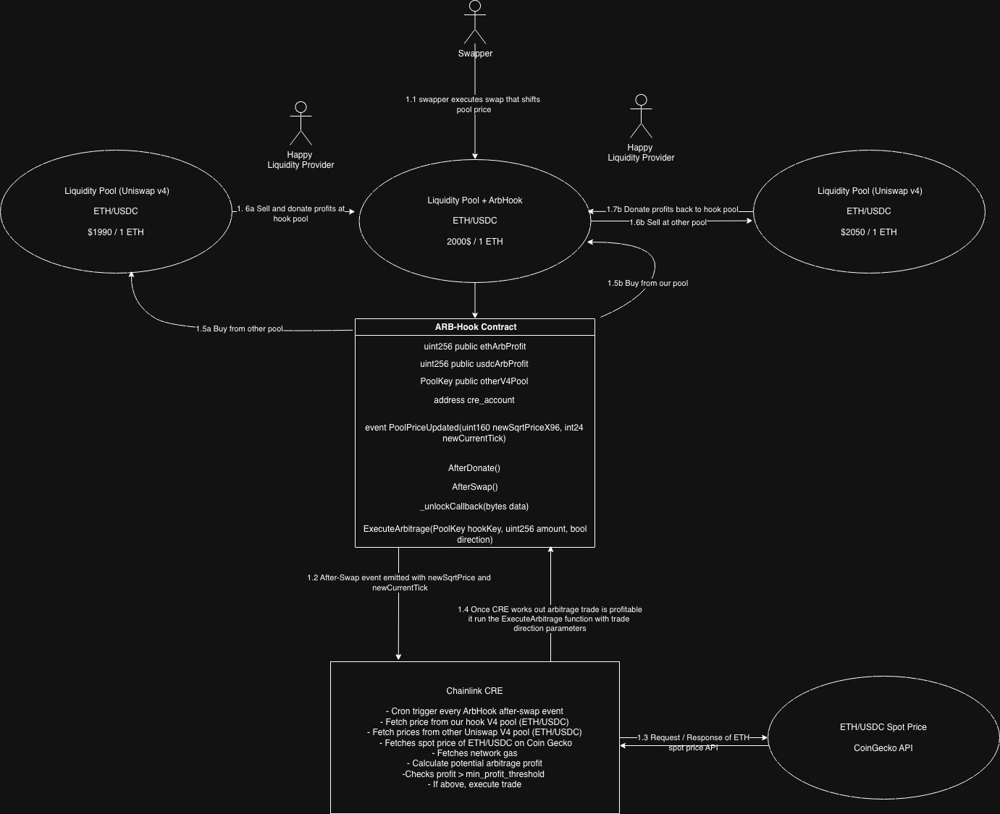

    # ARBHook

    ## Introduction

    Welcome to ArbHook, which is my submission project for the Chainlink Convergence hackathon 2026.

    ## Links

    **Chainlink CRE Code:**

    [`main.ts`](./cre/pool2poolArbitrage/main.ts) - Workflow entry point and cron trigger setup

    - [Arbitrage Logic (lib folder)](./cre/pool2poolArbitrage/lib/)
    - `calculateTradeProfit.ts` - Arbitrage detection and decision-making
    - `getETHMarketPrice.ts` - External API integration (ETH/USDC Spot Price / CoinGecko)
    - `poolFunctions.ts` - Uniswap V4 pool price and state fetching

    **Hook Contract:**

    - [ArbHook.sol](./hook/src/ArbHook.sol)
    - [ArbHook Tests](./hook/test/)

    Submission Demo:

    Presentation Slides: https://www.canva.com/design/DAHCDj7jpXM/v6yyKpWV2czkFv5Gh_g_sA/edit?utm_content=DAHCDj7jpXM&utm_campaign=designshare&utm_medium=link2&utm_source=sharebutton

    ## Problems being solved

    Firstly I would like to mention two problems that I noticed that this combination of Uniswap v4 hooks and Chainlink CRE solves:

    1. Liquidity providers suffer from impermanent loss when the price of assets in their pool diverges from the market price outside the AMM. This is one of the biggest deterrents for both DeFi power users and new investors when it comes to providing liquidity, which in turn limits the potential TVL of a pool. The natural remedy for this price divergence is arbitrage — bots monitor multiple pools, profit from the price discrepancies between them and in doing so rebalance the pool's price back to market rates. While this fixes the price divergence and stops further impermanent loss from accumulating, the potential arbitrage profit is extracted from our liquidity providers.

    2. Most pools compete for liquidity to increase their TVL, while never giving anything of value except basic swap fees, and liquidity providers are being increasingly more selective about where they deploy capital. In my opinion CLMM's have become the norm and you need more than concentrated liquidity and a points program to compete in today's market.

    My solution to this is ARBHook. Thanks to Chainlink CRE, instead of external arbitrageurs extracting value from the pool, the hook captures arbitrage opportunities itself and donates the profits back to LPs — directly offsetting their impermanent loss and increasing the value of their claim tokens. By offering this built-in protection, LPs have a concrete reason to choose this pool over a standard one, helping attract and retain liquidity, while driving higher TVL for the pool, protocol and the chain this hook is deployed on.

    ## How it works

    The ARB Hook and Chainlink CRE work together. The CRE listens to every afterSwap event that the hook emits with the new pool state. A quick calculation of the price divergence is done in afterSwap to ensure CRE computation checks are worthwhile before the event is emitted. When a swapper causes the pool price to diverge enough for an arbitrage opportunity, the Chainlink CRE executes the following steps:

    1. Fetches the quote price of our hook pool and the other pool with the same pair. Thanks to the Uniswap V4 Quoter contract, pool fees and price impact are already included in the output.

    2. Fetches the ETH/USDC spot price using the CoinGecko API.

    3. Fetches the network gas cost on the chain the hook is deployed on.

    4. Calculates the potential profit and checks it against our trade threshold.

    5. If above, executes the trade.

    Once CRE determines which pool to buy from and which to sell into, it writes to the hook contract `executeArbitrage()` function with the amount and direction of the trade. Inside the function the contract calls `poolManager.unlock(data)`, which triggers the `unlockCallback` function. Inside this callback, the contract swaps on both pools, takes the profit, and donates it back to the hook pool's LPs in a single atomic transaction thanks to Uniswap V4's flash accounting, if arbitrage is profitable.

    ## Architecture Diagram

    

    ## Tests

    Tests mainly cover the ARBHook contract and involve the following:

    1. Testing the `afterSwap` function, ensuring the event is emitted with the correct pool state values.

    2. Testing the `executeArbitrage` function inside the `FromHookArbitrage.t.sol` file, where the direction of the trade is buying from the hook pool and selling at the other pool. The test simulates two pools at different prices where the hook pool gets dumped on, creating cheap enough ETH to simulate profitable arbitrage.

    3. Testing the `executeArbitrage` function inside the `FromOtherPoolArbitrage.t.sol` file, where the direction of the trade is buying from the other pool and selling at our hook pool. The test dumps the other pool's price just before the trade to simulate profitable arbitrage.

    ## Future Roadmap

    I would like to continue this project after the hackathon. I believe it has the potential to become a top pool within the Uniswap ecosystem, however it has a long way to go from MVP to mainnet.

    Currently the hook alongside CRE only monitors one other pool. In a production version, I would like it to monitor multiple pools to capture more arbitrage opportunities, once that is done. I would like to start adding pools from Uniswap v3. Along side arbitrage strategies for different token pairs not just ETH/USDC

    Another consideration is the handling of in-range vs out-of-range positions within concentrated liquidity. It isn't fair that LPs who are out-of-range to receive arbitrage profits when they aren't actively providing liquidity. Using CRE to monitor LP positions off-chain would be the ideal approach, since handling this logic within the hook itself is possible but would be gas intensive for users swapping through the pool.

    Building a live frontend for this dex/hook, so users can go in create pools and swap. Even maybe think of a mechanic to reward swappers who cause price to fluctuate so the arbitrage trade can happen. So the whole eco-system is rewarded for participating.
